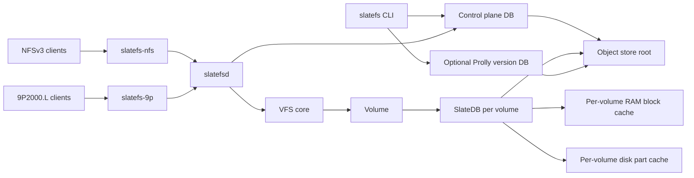
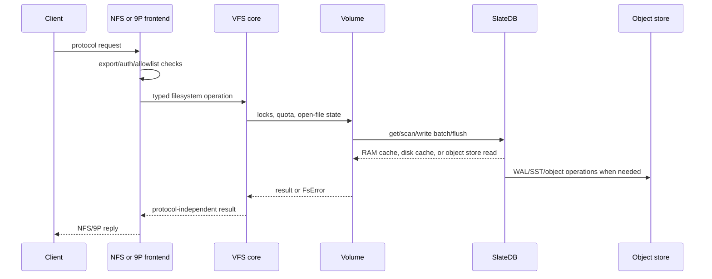

# SlateFS Architecture

This document describes the current SlateFS implementation. The original
design rationale remains in [slatefs-plan.md](../slatefs-plan.md); this file is
the shorter architecture map for engineers changing or operating the code.

SlateFS is a multi-tenant POSIX filesystem server. It exposes the same logical
filesystem through NFSv3 and 9P2000.L, stores every volume in SlateDB on top of
object storage, and uses per-volume encryption and cache namespaces.



## Component Map

| Component | Code | Responsibility |
|---|---|---|
| CLI | `crates/slatefs-cli` | Tenant, volume, quota, snapshot, clone, opt-in file versioning, key-rotation, scrub, and fsck operations. |
| Daemon | `crates/slatefs-daemon` | Loads config, resolves exports, opens volumes, starts NFS/9P listeners, metrics, and loopback admin endpoint. |
| VFS core | `crates/slatefs-core/src/vfs.rs`, `vfs_impl.rs` | Protocol-independent filesystem semantics and errno mapping. |
| Volume layer | `crates/slatefs-core/src/volume.rs` | One SlateDB writer per volume, mkfs/open, cache wiring, fencing, snapshots, clones. |
| Metadata codecs | `crates/slatefs-core/src/meta` | Inodes, directory entries, superblock, allocator, logical keys. |
| Control plane | `crates/slatefs-core/src/control.rs` | Tenants, volumes, states, wrapped keys, quotas, rate limits, file-handle HMAC key. |
| Crypto | `crates/slatefs-core/src/crypto` | KMS providers, key wrapping, block transformer, deterministic name encryption. |
| NFS frontend | `crates/slatefs-nfs` | `Vfs` to vendored `nfs3_server`; file handles, AUTH_UNIX credentials, squash policy. |
| 9P frontend | `crates/slatefs-9p` | `Vfs` to vendored `rs9p`; fid state, attach auth, optional rustls wrapping. |
| Vendored protocols | `crates/nfs3-server`, `crates/rs9p` | Small SlateFS patch sets over upstream BSD-licensed protocol crates. |

## Storage Model

The configured object-store URL is the deployment root. Under that root,
SlateFS keeps:

| Path | Owner | Purpose |
|---|---|---|
| `control.dek` | SlateFS | Wrapped control-plane DEK. |
| `control` | SlateDB | Encrypted control-plane database. |
| `volumes/<tenant>/<volume>` | SlateDB | One encrypted database per volume. |
| `versions/<tenant>/<volume>` | SlateDB + Prolly | Optional encrypted file-version repository, opened only for explicit versioning operations. |
| `version-leases/<tenant>/<volume>` | SlateFS | Conditional-write coordination record for explicit version operations. |

Each volume is an independent SlateDB database. This is the core isolation
decision: the volume DEK, SlateDB writer lease, cache namespace, quota counters,
checkpoints, and clones are all per volume.

SlateDB owns the physical SST/WAL/manifest layout below each database path.
SlateFS owns the logical records inside the control and volume keyspaces. The
current record contract is documented in
[on-disk-format.md](on-disk-format.md).

## Optional File Versioning

File versioning is a sidecar, not a filesystem storage requirement. A missing
control-plane policy means disabled. Enabling a filesystem volume records only
that policy; the separate `versions/<tenant>/<volume>` database is created
lazily by the first explicit version operation and reuses the volume DEK and
block transformer. Normal VFS, NFS, and 9P operations do not open or update it.

Each commit applies file metadata and content-chunk references to an immutable
Prolly tree. Chunks are content-addressed blobs, commit IDs are SHA-256 hashes,
and `heads/main` points to the current commit. Additional named branch
references can point to any existing commit, tag, or branch and can be used by
read, restore, diff, and history operations. Commits advance `main` by default
or an existing named branch when selected explicitly. Publishing a commit and
its branch reference is one SlateDB batch after the new immutable tree nodes
and blobs have been written. Disabling versioning blocks repository operations
without deleting its history. Volume deletion removes both the live and
optional version-store prefixes.

SlateFS atomically fast-forwards a target when its head is an ancestor of the
source and reports an already-current target as a no-op. Divergent branches
use their nearest common ancestor for a strict Prolly three-way merge. A
non-conflicting result is published as a two-parent commit; conflicting keys
return `409` and leave both heads unchanged. First-parent order drives log and
retention pagination, while verification and ancestry traverse the full DAG.
Merge preview runs the same strict diff planner without applying its mutations
and folds metadata/chunk conflicts into logical file paths.
An unbounded GC retains the full reachable DAG; bounded retention evaluates
first-parent history per branch and may prune older secondary ancestry.

Explicit version operations are serialized across processes before a SlateDB
version writer is opened. SlateFS creates or conditionally replaces the
per-volume `version-leases` record, renews it during the operation, and expires
it on close. The object contains only coordination metadata (owner UUID,
operation, and timestamps), never file content or key material. Conditional
revision updates prevent an expired owner from releasing a successor's lease.
Purge uses the same lease, so it cannot race repository reads, commits, or GC.
Backends without conditional update (notably local `file://`) release leases
normally but require confirmed-safe operator cleanup after a process crash;
they never perform an unsafe automatic takeover.

One commit can select multiple paths. Directories recursively capture regular
files, subdirectories, and symlinks; selected missing paths delete their old
tree entries, so a rename is represented by selecting both old and new paths.
All selected changes produce one Prolly root and one commit/ref publication.
Commit comparison uses Prolly structural diff and folds internal metadata and
chunk-key changes into one added, modified, or deleted result per path.
Restore recreates a selected directory tree entry-by-entry, with regular files
and symlinks replaced through same-directory temporary names. Offline commit
and restore open the volume writer directly. For served volumes, the CLI's
`--live` path calls the authenticated daemon admin API, which uses the
already-open `Volume` and therefore does not contend for or fence its writer
lease. Neither mode couples versioning to normal filesystem writes.

An optional control-plane retention record bounds commit count, age, and
logical history bytes. Maintenance retains the selected commit roots, uses
Prolly reachability for nodes and content blobs, and deletes unreachable
objects and expired commit records in one SlateDB batch. Each branch head is
always retained, and count/age selection is evaluated along every branch.
The daemon enforces count and age policies only for enabled
filesystem volumes whose writable backend it currently serves. It opens only
an existing history under the repository lease, preserving lazy creation and
avoiding work on disabled, unserved, or policyless volumes. Immutable named
tags and named branch heads add their referenced commit and tree to the GC
reachability roots. A physical purge deletes the separate version database
prefix under the same lease.

## Request Path



The frontends do not implement filesystem semantics. They translate wire
requests into the shared async `Vfs` trait, then map the result back to the
protocol. That is why NFS, 9P, snapshot exports, and cross-protocol tests all
exercise the same metadata and data paths.

## Metadata And Data

The volume keyspace is an inode filesystem mapped onto ordered key/value
records:

- `M`: immutable superblock.
- `i <ino>`: inode metadata.
- `d <parent> <enc_name>`: directory lookup by deterministic encrypted name.
- `e <parent> <dirent_id>`: stable readdir cookie index.
- `c <ino> <chunk>`: raw file chunk bytes, up to the volume chunk size.
- `s <ino>`: symlink target.
- `x <ino> <name>`: xattr value.
- `o <ino>`: orphan marker for unlinked but open files.
- `qB` / `qI`: quota byte and inode merge counters.
- `a`: inode allocator high-water mark.

File data is chunked. The default chunk size is 128 KiB and is fixed at volume
creation. Missing chunks are holes and read as zeros.

Every mutating filesystem operation is one atomic SlateDB write. Directory
renames, link-count updates, inode changes, dirent indexes, orphan markers, and
quota deltas are committed together so crash recovery cannot observe half of a
filesystem mutation.

## Concurrency And Consistency

SlateFS uses an in-process concurrency model because SlateDB is a single-writer
database:

- one writable `Volume` owns the SlateDB writer for a tenant/volume at a time;
- stale writers are fenced by SlateDB writer epochs;
- per-inode and directory locks serialize conflicting VFS operations;
- directory rename additionally serializes ancestor-cycle checks;
- advisory byte-range locks are held in the open volume;
- attr and negative-dentry caches are synchronous write-through read caches;
- one `Volume` is shared by all exports of the same tenant/volume in a daemon.

The consistency contract is close-to-open style across clients, matching the
chosen NFSv3/9P model. SlateFS does not provide multi-writer distributed POSIX
coherence for one volume.

Durability follows the protocol:

- normal writes may acknowledge after the write is accepted into SlateDB's
  buffered path;
- NFS `COMMIT`, NFS stable writes, and 9P fsync map to `Db::flush()`;
- after a successful flush, acknowledged data must survive daemon restart and
  writer takeover.

## Security Architecture

The key hierarchy is:

```text
master KMS -> control DEK
master KMS -> tenant KEK -> volume DEK
```

The control DB is encrypted with the control DEK. Each volume DB is encrypted
with its own volume DEK. SlateDB compresses blocks first; the SlateFS block
transformer then AEAD-seals the compressed bytes. This applies to WAL SSTs and
compacted SST blocks.

Filename confidentiality is handled separately from block encryption because
some SlateDB metadata can expose key ranges. Directory-entry lookup keys contain
AES-SIV encrypted names with per-directory derived keys. Plaintext names live in
the encrypted dirent values.

Frontend access boundaries:

- NFSv3 uses AUTH_SYS uid/gid assertions. Use export allowlists, network
  isolation, and squash policy; do not treat AUTH_SYS as cryptographic
  identity.
- 9P authenticates the connection with a bearer token at attach time. Optional
  rustls wrapping is available for client paths that can use it; kernel v9fs
  needs network isolation or a tunnel.
- NFS file handles include `{fsid, ino, generation}` and are HMAC protected by
  a server key from the control plane.

See [threat-model.md](threat-model.md) and
[security-review.md](security-review.md) for the reviewed controls and accepted
risks.

## Cache Architecture

SlateFS uses three cache tiers:

| Tier | Location | Contents | Notes |
|---|---|---|---|
| RAM block cache | Process memory | Plaintext decoded SlateDB blocks | Per volume. Never shared across volumes. |
| Disk part cache | Local disk/NVMe | Ciphertext object parts | Per volume. Safe on untrusted disks, subject to OS and key handling assumptions. |
| Object store | Durable backend | Encrypted WAL/SST objects | Source of durable truth. |

The RAM block cache is deliberately per volume. A shared-cache spike found that
SlateDB 0.13.1 WAL table identifiers are not globally unique across databases,
so a shared plaintext cache could alias blocks across tenants. Disk cache open
file handles are capped by config, with a conservative default, to avoid
exhausting daemon file descriptors under Blob-backed write load.

## Snapshots And Clones

Snapshots are SlateDB checkpoints for a volume. Snapshot exports serve a
checkpoint read-only through the same NFS/9P frontend stack. Served-volume
snapshots should be created through the daemon admin endpoint so the live writer
performs the checkpoint.

Writable clones are new volume records with new fsids. They can be created from
latest source state or from a checkpoint. Clones share source SSTs through
SlateDB until later writes and compaction separate their storage.

## Observability

`slatefsd` can expose Prometheus text at `[metrics].listen`. The endpoint
includes:

- volume liveness and degraded state;
- storage error counters;
- block decode failure counters;
- SlateDB cache, flush, write, object-store, and backpressure samples.

Starter alert rules are in
[monitoring/slatefs-prometheus-rules.yml](../monitoring/slatefs-prometheus-rules.yml).
The starter Grafana dashboard is in
[monitoring/slatefs-grafana-dashboard.json](../monitoring/slatefs-grafana-dashboard.json).

## Pre-GA Compatibility

SlateFS has no deployed compatibility contract yet. The current code and
[on-disk-format.md](on-disk-format.md) are authoritative. Do not add backwards
compatibility readers for old control records, volume records, or block formats
until a GA format contract exists.
