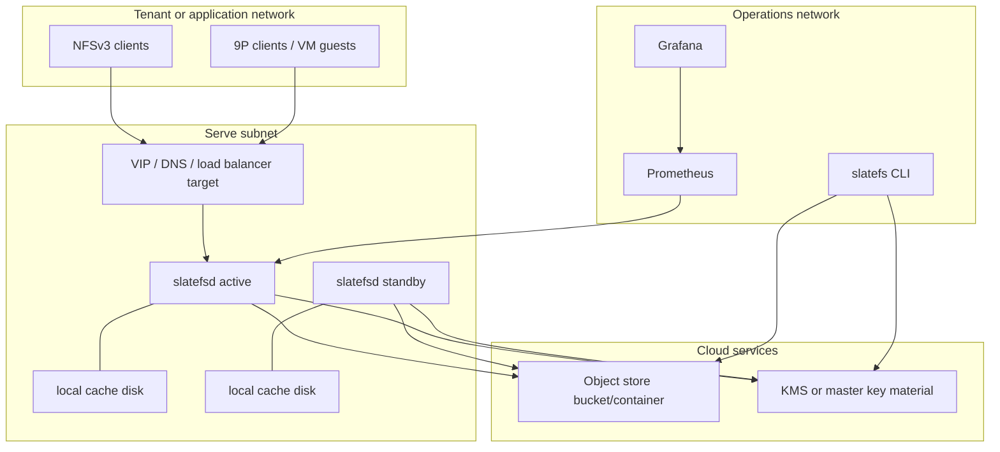

# SlateFS Deployment Architecture

This document describes how the current SlateFS components are deployed. It is
deployment guidance for the pre-GA codebase, not a hosted-service contract.

For implementation internals, see [architecture.md](architecture.md). For
operator drills, see [operations-runbook.md](operations-runbook.md).

## Deployment Units

| Unit | Runs where | Role |
|---|---|---|
| `slatefsd` | Linux VM, bare-metal host, container, or test harness | Serves configured exports and owns writable volume leases. |
| `slatefs` CLI | Operator workstation, admin host, or CI job | Creates tenants/volumes, manages quotas/snapshots/clones, runs scrub/fsck. |
| Object store | S3, Azure Blob, GCS, MinIO, or file store for tests | Durable WAL/SST/control storage. |
| KMS material | Static key, age keyfile, or cloud KMS provider | Wraps control and tenant keys. |
| Cache disk | Local SSD/NVMe on daemon host | Ciphertext SlateDB object part cache. |
| Prometheus | Local or central observability plane | Scrapes daemon `/metrics`. |
| Grafana | Local or central observability plane | Uses the starter SlateFS dashboard. |

The daemon is intentionally small: no external database besides the object
store is required for the current control plane. A deployment can start with one
daemon host and add standby hosts for failover.

## Reference Topology



Only one daemon should actively serve a writable volume at a time. The control
plane records which daemon is primary for each writable volume, which daemons
are standbys, and which stable client-facing endpoints currently target the
primary. SlateDB fencing is still the last line of defense if two active writers
race, but operators should make placement changes through `slatefs fleet ...`
so endpoint movement and ownership stay durable.

## Object Store Layout

Use one object-store root per environment or test run. Under that root, SlateFS
creates:

```text
control.dek
control/
volumes/<tenant>/<volume>/
```

For Azure Blob, the validated production-like harness uses a URL shaped like:

```text
https://<account>.blob.core.windows.net/<container>/<run-prefix>
```

Use a fresh prefix for destructive or performance test runs. Tenant and volume
delete remove known volume prefixes and drop wrapped keys from the current
control-plane state, but pre-GA test environments should still be treated as
disposable.

## Network Architecture

Each export has its own listener in config. A listener can serve NFSv3 or
9P2000.L.

| Port/surface | Direction | Notes |
|---|---|---|
| NFS export listener | Client -> daemon | One configured `listen` address per NFS export. Mount with `vers=3,tcp,nolock`. |
| 9P export listener | Client -> daemon | One configured `listen` address per 9P export. Optional rustls wrapping. |
| Metrics listener | Prometheus -> daemon | Optional `[metrics].listen`; expose only to observability network. |
| Admin listener | CLI/operator -> daemon | Optional `[admin].listen`; must be loopback. Used for live-writer snapshot creation. |
| Object store | daemon/CLI -> store | Durable WAL/SST/control IO. |
| KMS | daemon/CLI -> KMS | Key unwrap/rewrap. |

NFSv3 AUTH_SYS is not cryptographic authentication. Bind tenants to network
boundaries: per-tenant VPC/VNet/subnet, firewall rules, WireGuard/VPN, security
groups, or source-IP allowlists. Configure `allowed_clients` on exports as a
defense-in-depth gate.

9P bearer tokens are tenant-wide secrets. Use rustls-wrapped 9P where possible.
Linux kernel v9fs over plaintext TCP should run inside a tenant-isolated network
or tunnel.

## Fleet Placement And Active/Standby HA

The fleet control layer is active/standby per writable volume:

1. Register daemon nodes with capacity and operator-visible endpoints.
2. Heartbeat health and load snapshots from each node or controller poller.
3. Volume creation assigns placement to the lowest-load healthy node when fleet
   nodes are registered.
4. Stable per-volume endpoints point at the current primary node by generation.
5. On failure, promote a healthy standby; the endpoint target moves to the
   promoted node and the failed node is marked unhealthy.
6. For planned movement, drain a volume, open it on the target node, then
   complete the drain to move primary ownership and stable endpoints.
7. For read-heavy workloads, add read replicas or snapshot-serving pools; they
   are placement records, not multi-writer state.

Example operator flow:

```sh
slatefs -c /etc/slatefs/slatefs.toml fleet node register daemon-a \
  --advertise-endpoint 10.42.0.10:2049 \
  --metrics-endpoint 10.42.0.10:13052 \
  --capacity-weight 1
slatefs -c /etc/slatefs/slatefs.toml fleet node register daemon-b \
  --advertise-endpoint 10.42.0.11:2049 \
  --metrics-endpoint 10.42.0.11:13052 \
  --capacity-weight 1

slatefs -c /etc/slatefs/slatefs.toml fleet node heartbeat daemon-a \
  --writable-volumes 2 --request-ops-per-second 4000
slatefs -c /etc/slatefs/slatefs.toml fleet node heartbeat daemon-b \
  --writable-volumes 0 --request-ops-per-second 1000

slatefs -c /etc/slatefs/slatefs.toml volume create prod v2
slatefs -c /etc/slatefs/slatefs.toml fleet volume endpoint set prod v2 \
  --name default --protocol nfs --address nfs://prod-v2.example.internal/

# Unplanned failure of the current primary:
slatefs -c /etc/slatefs/slatefs.toml fleet volume promote prod v2 \
  --failed-node daemon-a

# Planned movement:
slatefs -c /etc/slatefs/slatefs.toml fleet volume drain prod v2 \
  --target-node daemon-b
# Start/open the target daemon export, then:
slatefs -c /etc/slatefs/slatefs.toml fleet volume complete-drain prod v2

# Read-heavy adjuncts:
slatefs -c /etc/slatefs/slatefs.toml fleet volume replica add prod v2 \
  --node daemon-b --lag-seconds 5
slatefs -c /etc/slatefs/slatefs.toml fleet volume snapshot-pool set prod v2 \
  --name reporting --node daemon-a --node daemon-b --max-exports 64
```

`slatefs fleet health --heartbeat-timeout-secs 60` marks healthy/draining nodes
unhealthy when their last heartbeat is stale. Daemons still use SlateDB writer
fencing at open time: a stale primary that keeps running will observe fencing,
mark the volume dead locally, and drop exports.

The automated drill is:

```sh
scripts/docker-kernel-mount-test.sh scripts/nfs-failover-drill.sh
```

For the Phase 6 target, run it with fio load and a 10 second failover gate as
documented in [performance.md](performance.md).

## Cache And Disk Sizing

Recommended starting point:

```toml
[cache]
memory_bytes = 8589934592        # optional, divided across open volumes
disk_path = "/var/cache/slatefs"
disk_bytes = 68719476736         # optional, divided across open volumes
disk_max_open_files = 256
```

RAM cache holds plaintext decoded blocks and must stay process-local and
per-volume. Disk cache holds ciphertext object parts and can live on untrusted
local disks from a data-confidentiality perspective, but the daemon host still
holds DEKs in memory while serving.

For write-heavy object-store-backed runs, use bounded SlateDB settings like:

```toml
[slatedb]
l0_sst_size_bytes = 16777216
max_unflushed_bytes = 268435456
l0_max_ssts = 64
l0_max_ssts_per_key = 16
l0_flush_parallelism = 2
compaction_max_sst_size_bytes = 67108864
compaction_max_concurrent = 2
compaction_max_fetch_tasks = 2
```

These are the settings used by the current performance harnesses. Revisit them
per instance size, cache disk, and object store.

## Configuration Skeleton

```toml
[object_store]
url = "https://account.blob.core.windows.net/container/prod-prefix"

[kms]
provider = "static"
key_hex = "0000000000000000000000000000000000000000000000000000000000000001"

[cache]
disk_path = "/var/cache/slatefs"
disk_bytes = 68719476736
disk_max_open_files = 256

[metrics]
listen = "0.0.0.0:13052"

[admin]
listen = "127.0.0.1:14052"

[[exports]]
tenant = "prod"
volume = "v1"
listen = "0.0.0.0:12052"
allowed_clients = ["10.42.0.0/16"]
squash = "root_squash"

[[exports]]
tenant = "prod"
volume = "v1"
protocol = "p9"
listen = "0.0.0.0:12053"
p9_token = "replace-with-tenant-secret"
allowed_clients = ["10.42.0.0/16"]
```

Use real KMS material for production-like environments. The static key provider
is suitable for local development, tests, and disposable performance rigs.

## Azure Production-Like Harness

The checked-in Azure harness creates a fresh rig and validates the deployment
shape end to end:

```sh
AZURE_SUBSCRIPTION_ID=0a1ca07f-76d3-4739-b946-58d39524082f \
scripts/azure-prodtest.sh all
```

Default shape:

- East US 2 resource group;
- Standard LRS storage account and Blob container;
- one client VM;
- two daemon VMs for active/standby shape;
- private VNet traffic between client and daemon;
- local Prometheus and Grafana connected through an SSH metrics tunnel;
- fio matrix over a kernel NFSv3 mount;
- artifact collection under `target/azure-prodtest-<run-id>/`;
- VM deallocation on exit.

For a cheap smoke:

```sh
AZURE_PRODTEST_CREATE_DAEMON2=0 \
AZURE_PRODTEST_VM_SIZE=Standard_D2ds_v5 \
AZURE_PRODTEST_FIO_RUNTIME=1 \
AZURE_PRODTEST_FIO_SIZE=16m \
AZURE_PRODTEST_FIO_BS_LIST=4k \
AZURE_PRODTEST_FIO_RW_LIST=write \
AZURE_PRODTEST_META_OPS=1 \
scripts/azure-prodtest.sh all
```

The harness leaves resource groups and storage unless
`AZURE_PRODTEST_DELETE_RG=1` is set, but deallocates VMs by default because VM
compute is the main cost driver.

## Observability Deployment

At minimum, scrape every served daemon's `/metrics` endpoint. Alert on:

- missing scrapes;
- `slatefs_volume_dead == 1`;
- `slatefs_volume_degraded == 1`;
- storage error rates;
- block decode failures.

The starter rules and dashboard live in:

- [monitoring/slatefs-prometheus-rules.yml](../monitoring/slatefs-prometheus-rules.yml)
- [monitoring/slatefs-grafana-dashboard.json](../monitoring/slatefs-grafana-dashboard.json)

When a run ends and VMs are deallocated, live `up` targets will be down. Use a
pinned Grafana time range to inspect historical run data.

## Snapshot And Restore Deployment

Configure `[admin].listen` on loopback for served-volume snapshot creation:

```sh
slatefs -c /etc/slatefs/slatefs.toml snapshot create --live prod v1 --name before-upgrade
```

Snapshot exports are read-only `[[exports]]` entries with a configured
`snapshot` checkpoint id. Writable restore workspaces should be clones:

```sh
slatefs clone create prod v1 restore-v1 --snapshot <checkpoint-id>
```

Run `slatefs volume scrub <tenant> <volume>` after restore or failover drills.

## Operations Checklist

Before serving production-like clients:

- object-store root is fresh or intentionally reused;
- KMS material is reachable from daemon and CLI hosts;
- daemon hosts have NTP/time sync;
- cache disk exists, has enough space, and is writable by `slatefsd`;
- daemon file descriptor limit is compatible with cache and client load;
- NFS/9P listeners are reachable only from intended client networks;
- metrics are scraped and dashboard datasource is correct;
- failover drill has been run against the topology;
- snapshot/restore drill has been run against the topology;
- all VMs in disposable rigs are deallocated after test runs.

## Pre-GA Upgrade Posture

There is no deployed compatibility contract yet. Prefer fresh object-store
prefixes for new production-like runs. If the format changes, use one of the
pre-GA paths from [on-disk-format.md](on-disk-format.md): recreate throwaway
volumes, run a deliberate one-off migration, or export/import through a mounted
filesystem. Do not preserve old readers by default.
