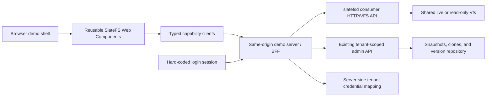

# SlateFS Consumer Demo Website and Reusable Web Components Plan

Status: proposed, implementation-ready

Date: 2026-07-15

Primary repository: `/Users/dunnry/src/slatefs`

Audience: agents implementing the consumer demo, the browser-facing SlateFS API, and reusable UI packages

## 1. Outcome

Build a standalone, consumer-facing website that demonstrates SlateFS as a normal filesystem and as an opt-in versioned filesystem. The site must be useful as a demo, but its major features must be exported as framework-independent Web Components that another application can embed without taking the demo shell, router, authentication screen, or global state.

The finished experience should let a signed-in demo user:

- browse only that user's tenant and volumes;
- perform familiar file operations, including drag-and-drop upload and move, create, rename, copy, cut, paste, delete, download, preview, and small text edits;
- inspect metadata, quota usage, permissions, symlinks, and extended attributes where appropriate;
- create and browse whole-volume snapshots, and create a writable clone from a snapshot;
- explicitly version selected files or directories;
- inspect status and history, compare versions, view file content from a version, tag commits, and restore a file or tree;
- create and inspect branches, preview and perform merges and cherry-picks, inspect conflicts, and use reflog-based recovery;
- optionally demonstrate advanced repository features such as branch protection, attestations, repository bundles, native branch sync, retention statistics, and verification;
- switch between public demo accounts to prove tenant isolation.

This is a plan only. Do not treat this file as authorization to publish the site or expose a development daemon publicly.

## 2. Repository-grounded constraints

The implementation must preserve these current SlateFS semantics:

1. `Vfs` is the source of truth for filesystem permissions, atomic rename, quota enforcement, sparse I/O, symlinks, hardlinks, xattrs, and errno behavior. The browser data plane must translate HTTP to `Vfs`; it must not reimplement filesystem semantics in JavaScript.
2. The browser cannot use the existing NFSv3, 9P2000.L, or NBD frontends directly. SlateFS currently has no HTTP endpoint for live directory listing or file mutation. A browser-oriented HTTP/VFS adapter is therefore a required backend prerequisite.
3. The existing daemon admin API already covers tenant-scoped volume inventory, quota detail, live snapshots, clones, and nearly all live versioning operations. Reuse those routes behind the demo server instead of duplicating versioning logic.
4. A writable volume has one active SlateDB writer. Do not build a separate demo service that opens the same volume as a second writer. The live HTTP file adapter must run inside `slatefsd` and reuse its open volume registry.
5. File versioning is explicit and opt-in. Ordinary file writes do not automatically create version commits.
6. A version branch is a history reference, not a checked-out working tree. Selecting or moving a branch does not change the live filesystem. The UI must say “publish to branch” and “restore to live files,” not imply Git-style checkout semantics that SlateFS does not provide.
7. Version merge and cherry-pick change version history only. A restore is the operation that copies versioned state into the live filesystem.
8. Snapshot restore is currently modeled as a writable same-tenant clone. Do not label it as destructive in-place rollback. Use “Create writable copy” or “Restore as new volume.”
9. Historical version and snapshot views are read-only. All write controls must disappear or be disabled while browsing one.
10. Tenant credentials are restricted to their matching `/admin/v1/tenants/{tenant}/...` subtree. The browser must never receive an admin token or tenant bearer token.

## 3. Scope boundaries

### In scope

- A local-first standalone demo harness with simple public demo accounts.
- A new tenant-scoped HTTP file data plane embedded in `slatefsd`.
- A typed browser client and reusable Web Component package.
- A same-origin demo server/BFF that owns sessions and SlateFS credentials.
- Live file browsing and mutations for filesystem volumes.
- Read-only browsing of snapshots and version references.
- Existing consumer-meaningful snapshot, clone, and version-control features.
- Seeded data and scripted scenarios that make the features visible immediately.
- Contract, isolation, component, accessibility, and end-to-end tests.
- Documentation showing Web Component use in a plain HTML page and one framework host.

### Explicitly not part of the consumer launch surface

- Fleet placement, node health, failover, export reconciliation, tenant suspension, key rotation, KMS, fsck, scrub, rate-limit configuration, quota administration, snapshot retention administration, lease breaking, GC execution, and history purge. These remain operator/admin functions.
- Editing block/NBD volumes in a file explorer. Block volumes may be shown as unsupported in volume inventory, but the explorer must not pretend they contain a browsable POSIX tree.
- Replacing `slate-admind`. That product remains the operator-facing portal; this is a separate consumer demo.
- Production identity-provider integration. The architecture must leave a clean seam for it, but the demo uses local hard-coded users.
- A browser-implemented NFS, 9P, or NBD client.
- Automatic version commits after every file mutation.
- A Trash abstraction. Delete means a real filesystem delete; recovery is available only when prior versioned or snapshot state exists.
- Global full-text indexing. Launch with current-directory filtering and optionally add bounded recursive filename search later.

## 4. Architecture decision

Use four separately testable layers:



### Locked implementation choices

- TypeScript and Lit for standards-based custom elements.
- Shadow DOM by default, with CSS custom properties, named slots, and `::part` for host styling.
- A small typed client package with interface-segregated capabilities; components receive clients through JavaScript properties and do not create global clients.
- A Vite-built demo SPA.
- A Node 22 server using Fastify (or an equivalently small same-origin server if the repository adopts a different standard before implementation) for login, sessions, CSRF protection, static assets, and upstream proxy/orchestration.
- pnpm with a committed lockfile for the JavaScript workspace.
- A versioned `/consumer/v1` HTTP surface embedded in `slatefsd` for live and historical file access.
- Existing `/admin/v1/tenants/{tenant}/...` routes remain the source for snapshots, clones, quota/volume detail, and versioning.
- The demo binds to loopback by default and uses a `file://` SlateFS store so it can run without MinIO or privileged kernel mounts.

The demo server is not a second filesystem server. It is a session boundary and API facade. It must stream bytes to and from `slatefsd`, not mount a volume or open SlateDB directly.

## 5. Proposed repository layout

```text
crates/
  slatefs-http/                       # New HTTP-to-Vfs consumer frontend
    src/
      lib.rs
      auth.rs
      dto.rs
      errors.rs
      paths.rs
      routes.rs
      streaming.rs
    tests/
      consumer_api.rs
      tenant_isolation.rs
      historical_views.rs
  slatefs-daemon/
    src/main.rs                       # Listener/config wiring and shared-volume lookup

docs/api/
  consumer-v1.openapi.yaml           # Browser data-plane contract
  consumer-v1-errors.md

web/
  package.json
  pnpm-workspace.yaml
  pnpm-lock.yaml
  tsconfig.base.json
  packages/
    client/                           # @slatefs/client
      src/
      test/
    web-components/                   # @slatefs/web-components
      src/
      test/
      custom-elements.json
  apps/
    demo/
      src/                            # Shell, routes, account switcher, composition only
      public/
    demo-server/
      src/                            # Sessions, proxy, orchestration, static serving
      test/
  examples/
    vanilla/                          # Plain HTML component embedding proof
    react/                            # Thin host integration proof; no React internals in components

scripts/
  web-demo.sh                         # up, down, reset, seed, and test modes
  web-demo-seed.sh                    # Idempotent tenant/volume/content/history setup

plans/
  consumer-demo-web-components-plan.md
```

Add `slatefs-http` to the Cargo workspace and add a separate JavaScript CI job; do not make the normal Rust build require Node unless the daemon is explicitly packaging prebuilt demo assets.

## 6. Backend capability map

| Consumer capability | Current SlateFS backing | Work required |
| --- | --- | --- |
| List accessible volumes and show quota/detail | Existing tenant volume admin routes | BFF facade and consumer-safe DTO |
| List live directories and stat entries | `Vfs::lookup`, `getattr`, `readdir`, `statfs` | New `/consumer/v1` adapter |
| Read/download/preview live files | `Vfs::read`, `readlink` | New streaming/range routes |
| Create files/folders/symlinks/hardlinks | `Vfs::create`, `mkdir`, `symlink`, `link` | New mutation routes |
| Upload/overwrite/edit | `Vfs::create`, `write`, `setattr`, `fsync`, atomic rename | New staged streaming upload route |
| Rename/move/delete | `Vfs::rename`, `unlink`, `rmdir` | New mutation routes; bounded recursive delete orchestration |
| Copy/paste | VFS read/write/create primitives | New server-side bounded copy operation |
| Permissions and xattrs | `getattr`, `setattr`, xattr methods | New metadata routes and properties UI |
| Create/list snapshots | Existing live admin routes | BFF facade and snapshot component |
| Browse a snapshot | Existing `SnapshotVolume`/read-only export behavior | New read-only HTTP view adapter |
| Restore snapshot | Existing same-tenant clone route | Present as “Create writable copy” |
| Enable/status/commit/log/show/diff/restore | Existing versioning admin routes | Typed client, consumer wording, and UI |
| Browse an entire version tree | Existing `VersionSnapshot` and historical export behavior | New read-only HTTP view adapter; current content route alone is insufficient |
| Content diff | Existing path diff plus ranged version content | Fetch both sides and compute bounded text diff in browser worker |
| Branches/tags/protection/reflog | Existing versioning admin routes | Branch/history components |
| Merge and cherry-pick | Existing preview and apply routes | Preview-first UI and conflict handling |
| Attestations/quorum | Existing routes and core format | Advanced UI; add signing-payload contract or golden cross-language fixtures |
| Repository bundle import/export | Existing native media routes | Advanced streaming BFF actions |
| Native branch sync | Existing advertise/export/apply routes | BFF orchestration between explicitly allowed targets |
| Retention statistics and verification | Existing read routes | Read-only repository health panel |
| NFS/9P connection information | Export metadata is currently admin-only | Optional consumer-safe, secret-free connection DTO; no export mutation |

## 7. New consumer HTTP/VFS API

### 7.1 Authentication and tenant routing

- Add a `/consumer/v1` prefix to the daemon and authenticate it with configured tenant tokens.
- Enable it with a separate loopback `[consumer].listen` address, but reuse the existing `[admin.tenant_tokens]` and `[admin.tenant_token_files]` credential sources so the BFF needs only one scoped upstream credential. Configure fixed uid/gid values under `[consumer.tenant_identities.<tenant>]`. Do not let the global admin token authorize consumer routes in v1.
- Resolve the tenant from the authenticated credential. Do not accept a tenant name in consumer route paths or request bodies.
- Route only to volumes owned by that resolved tenant.
- The demo BFF stores one upstream tenant credential per hard-coded account mapping. The credential stays server-side and is never serialized to HTML, JavaScript, local storage, logs, or error payloads.
- Configure a fixed POSIX identity per demo account/tenant for VFS credentials, initially uid/gid `1000:1000`. Do not accept arbitrary uid/gid assertions from an untrusted browser.
- Live version commits may set the content `author` to the signed-in demo user's display identity. The current tenant token remains the server-derived committer. Record this limitation in the UI rather than using the global admin token for impersonation.
- A later production extension may add trusted delegated identity from an mTLS-authenticated gateway. That is not required for the demo and must not be approximated with an unsigned public header.

### 7.2 Versioning and compatibility rules

- Publish and review `docs/api/consumer-v1.openapi.yaml` before writing the TypeScript client.
- Treat v1 as extend-only: add fields and routes, do not rename or change meanings after the client package is released.
- Unknown JSON response fields must be ignored by clients.
- Mutating requests use `X-Request-Id` and `Idempotency-Key` where retry is meaningful.
- Preserve the existing error envelope shape: `{"error":{"code","message","request_id","details"}}`.
- Add contract fixtures generated by Rust and consumed by TypeScript tests.
- Add an API snapshot/approval test so an agent cannot accidentally change the public HTTP surface unnoticed.

### 7.3 Core routes

Use these routes as the target contract. Query names may be refined during the OpenAPI review, but the semantics are fixed.

| Method | Route | Purpose |
| --- | --- | --- |
| `GET` | `/consumer/v1/capabilities` | Supported API version, limits, and feature flags. |
| `GET` | `/consumer/v1/volumes` | Filesystem volumes visible to the authenticated tenant. Block volumes are returned with `browsable:false`. |
| `GET` | `/consumer/v1/volumes/{volume}` | Consumer-safe volume detail and live quota/statfs usage. |
| `GET` | `/consumer/v1/volumes/{volume}/entries` | List/stat an entry with `path`, `view`, `ref`, `limit`, and `page_token`. |
| `POST` | `/consumer/v1/volumes/{volume}/entries` | Create a file, directory, or symlink. |
| `PATCH` | `/consumer/v1/volumes/{volume}/entries` | Rename/move an entry or change mode/ownership fields allowed to the current VFS identity. |
| `DELETE` | `/consumer/v1/volumes/{volume}/entries` | Delete one path; `recursive=true` is explicit and bounded. |
| `GET` | `/consumer/v1/volumes/{volume}/content` | Stream file/symlink bytes with HTTP Range support and download headers. |
| `PUT` | `/consumer/v1/volumes/{volume}/content` | Stream a new or replacement file through a staged sibling and atomic rename. |
| `POST` | `/consumer/v1/volumes/{volume}/operations` | Server-side copy, move, or hardlink with an explicit conflict policy. |
| `GET` | `/consumer/v1/volumes/{volume}/xattrs` | List or read xattrs for a path. |
| `PATCH` | `/consumer/v1/volumes/{volume}/xattrs` | Set or remove allowed xattrs. |

`view` is one of `live`, `snapshot`, or `version`. `ref` is required for snapshot/version views and forbidden for live. Every mutation route rejects non-live views as read-only.

### 7.4 Entry and path contract

Every entry DTO should include:

- an opaque `entry_id` suitable for subsequent API calls;
- canonical parent and path identifiers;
- `name` when it is valid UTF-8 and `name_bytes_base64` for lossless round-trip;
- kind: file, directory, symlink, or special;
- inode, generation, size, allocated bytes, mode, uid, gid, link count, and timestamps;
- read-only and capability flags such as `can_read`, `can_write`, `can_delete`, and `can_rename`;
- a weak ETag derived from immutable identity plus current metadata for optimistic edit/upload checks;
- symlink target only when specifically requested and authorized.

Read and mutation routes accept an opaque `entry_id` in preference to a display path; create/move operations identify the destination parent by opaque ID and carry the new basename separately. Human-readable `path` remains a convenience for valid UTF-8 names and deep links. Creation from the browser supports UTF-8 names. Listing must not corrupt pre-existing non-UTF-8 names. Avoid lossy string conversion and never resolve `..` or an absolute client path outside the volume root.

### 7.5 Streaming and concurrency

- Never buffer a full upload, download, repository bundle, or large versioned file in the BFF or daemon.
- Use bounded chunks and propagate cancellation with `AbortSignal`/connection close.
- Replacement upload writes a hidden temporary sibling, fsyncs it, then renames it over the destination. Clean abandoned temporary entries.
- Require `If-Match` for overwriting a file opened in the text editor. Return `412` on concurrent modification and offer reload/save-as in the UI.
- Directory listing uses opaque pagination tokens backed by VFS readdir cookies.
- Recursive copy/delete must have entry and byte ceilings returned by capabilities. Return a preview/count before a destructive large recursive action.
- Map quota exhaustion to HTTP `507`, permission failures to `403`, missing paths to `404`, name/existence/conflict failures to `409`, stale optimistic state to `412`, and invalid paths/types to `422`.

### 7.6 Historical views

- Reuse `SnapshotVolume` for snapshot browsing and `VersionSnapshot` for version browsing.
- Reuse daemon-managed open objects and checkpoints so a historical browser request does not create a competing writer.
- Resolve a symbolic version reference once per response and return the exact commit ID. The client pins that ID while the user browses so a moving branch cannot change the view mid-session.
- Historical views expose list, stat, read, preview, and download only.
- Add bounded caches for read-only view handles and release them on idle timeout; do not create durable export records just to browse in the website.

## 8. Demo server and hard-coded login

### 8.1 Accounts

Seed and display these intentionally public local-demo accounts:

| Login | Password | Tenant | Initial volumes | Purpose |
| --- | --- | --- | --- | --- |
| `alice` | `slatefs` | `acme` | `documents`, `documents-mirror` | Rich file/version/snapshot scenario |
| `bob` | `slatefs` | `globex` | `media` | Tenant-isolation proof with different data |

The login page must label these as demo credentials, not secure defaults. The server must refuse a non-loopback bind while demo credentials are enabled unless an explicit unsafe-development flag is supplied.

### 8.2 Session behavior

- Validate credentials only on the server.
- Use a short-lived opaque session in an `HttpOnly`, `Secure` when HTTPS, `SameSite=Strict` cookie.
- Generate the session signing/encryption secret at startup unless one is supplied through an environment variable.
- Issue and validate a CSRF token for every mutation.
- Derive tenant, upstream token, display user, uid, and gid from the session. Never accept them from normal API parameters.
- Do not put bearer credentials or file contents in logs.
- On logout, invalidate the server-side session and clear all component selection/clipboard state.
- Return `401` for an expired session; the client emits one `slatefs-auth-required` event so the shell can navigate to login.

### 8.3 BFF facade

Expose same-origin `/api/v1/...` routes to the browser. They should:

- omit tenant from paths and derive it from the session;
- proxy live file routes to `/consumer/v1`;
- translate existing tenant admin routes into consumer vocabulary for snapshots, clones, and versioning;
- preserve upstream request IDs in responses and error UI;
- stream binary bodies without base64 conversion when the upstream already uses a binary media type;
- offer capability discovery so each component can hide unsupported operations;
- allow native sync only between server-configured destinations; never accept an arbitrary remote admin URL from a browser.

## 9. Typed client and public component API

### 9.1 Interface segregation

The client package should export narrow interfaces rather than one mandatory monolith:

```ts
interface FileSystemClient { /* list, stat, read, upload, create, mutate, copy */ }
interface SnapshotClient { /* list, create, browse reference, clone */ }
interface VersionClient { /* policy, status, commit, log, refs, diff, restore */ }
interface CollaborationClient { /* merge, cherry-pick, reflog, protection, attest */ }
interface RepositoryClient { /* bundle, sync, stats, verify */ }
```

Export `SlateFsClient` as their intersection for the demo shell. Every async method accepts an `AbortSignal`; streaming methods expose progress without requiring components to know whether XHR, fetch streams, or another transport is used.

Do not make components depend on:

- the demo router;
- the hard-coded login implementation;
- a global store or singleton client;
- Lit context that an external host cannot replace;
- the BFF's exact URL structure.

### 9.2 Public Web Components

| Element | Responsibility | Required client capability |
| --- | --- | --- |
| `<slatefs-volume-picker>` | Choose an accessible filesystem volume and show quota/kind badges. | `FileSystemClient` |
| `<slatefs-file-explorer>` | Breadcrumbs, list/grid, selection, file operations, drag/drop, clipboard, upload queue. | `FileSystemClient` |
| `<slatefs-file-preview>` | Text, image, PDF/browser-safe media preview, download fallback, historical read-only banner. | `FileSystemClient` |
| `<slatefs-file-properties>` | Metadata, permissions, ownership, symlink target, and xattrs. | `FileSystemClient` |
| `<slatefs-snapshot-manager>` | Create/list snapshots, open read-only views, and create writable clones. | `SnapshotClient` + read capability |
| `<slatefs-version-status>` | Compare live paths to a reference, select changes, and commit selected paths. | `VersionClient` |
| `<slatefs-version-history>` | Paginated history, commit graph/parents, path filter, tags, and content opening. | `VersionClient` |
| `<slatefs-diff-viewer>` | Path summary plus side-by-side/unified bounded text diff and binary metadata. | `VersionClient` + read capability |
| `<slatefs-branch-manager>` | Branches, publish target, protection, reflog, merge, cherry-pick, reset/recovery. | `VersionClient` + `CollaborationClient` |
| `<slatefs-restore-dialog>` | Overlay/exact preview, action review, token apply, stale-plan retry. | `VersionClient` |
| `<slatefs-repository-tools>` | Advanced bundles, configured sync, attestations, stats, and verification. | `RepositoryClient` + `CollaborationClient` |

Internal toolbar, file-row, dialogs, toasts, virtual list, and upload-row elements may remain private until a second use case justifies a supported contract.

### 9.3 Common properties and events

Common JavaScript properties:

- `client`: the relevant capability object; property-only, not a serialized attribute;
- `volume`: current volume name;
- `path`: canonical current path;
- `view`: `{ kind: 'live' | 'snapshot' | 'version', ref?: string, resolvedCommit?: string }`;
- `selection`: controlled or initial entry selection where applicable;
- `readonly`: host override in addition to server capability checks;
- `density`: `comfortable` or `compact`.

Events must bubble and be composed across shadow roots:

- `slatefs-volume-change`
- `slatefs-path-change`
- `slatefs-selection-change`
- `slatefs-view-change`
- `slatefs-operation-start`
- `slatefs-operation-complete`
- `slatefs-operation-error`
- `slatefs-auth-required`

Before a destructive operation, emit a cancelable `slatefs-before-operation` event with a versioned detail object. If not canceled, the component may show its default confirmation and proceed. Result events include `requestId` so host applications can correlate logs.

### 9.4 Styling and accessibility contract

- Use semantic controls and real focus order; never make a `div` behave like a button without keyboard semantics.
- Meet WCAG 2.2 AA contrast and visible-focus requirements.
- Support keyboard file navigation, selection, rename, copy, cut, paste, delete, open, and escape-to-cancel.
- Provide screen-reader announcements for upload progress, completed operations, conflicts, and view changes.
- Expose stable CSS custom properties for color, spacing, typography, radius, and focus ring.
- Expose deliberate `::part` names for toolbar, breadcrumb, list, row, icon, preview, inspector, dialog, and status badge.
- Support light/dark host themes without bundling a demo-specific brand into the component package.
- Publish `custom-elements.json` and TypeScript declarations.

## 10. Demo information architecture

The demo shell should remain thin. Suggested routes:

- `/login`
- `/files/:volume/*path`
- `/snapshots/:volume`
- `/versions/:volume/history`
- `/versions/:volume/branches`
- `/versions/:volume/compare`
- `/versions/:volume/repository`

Desktop layout:

- top bar: SlateFS demo identity, tenant badge, volume picker, quota meter, account switch/logout;
- left navigation: Files, Snapshots, Version history, Branches, Advanced;
- center: active reusable component;
- optional right inspector: preview/properties or selected version details;
- bottom operation tray: uploads, copies, and recent request IDs.

Mobile layout stacks navigation and inspector as drawers. Do not remove core file actions on touch devices; replace desktop drag-only behavior with explicit Move/Copy/Upload buttons.

## 11. File explorer behavior

### Required launch operations

- list and paginate directory entries;
- breadcrumbs and back/forward navigation;
- list and grid modes, sortable columns, and current-directory filtering;
- single and multi-selection with mouse, touch, and keyboard;
- create empty file and folder;
- rename and move;
- copy, cut, and paste within one volume;
- drag entries between folders to move, with modifier/explicit menu to copy;
- drag files and folders from the desktop to upload while preserving relative paths when the browser supplies them;
- conflict choices: fail, overwrite, keep both, or skip; never silently overwrite;
- delete file and recursive directory with a preview/count and confirmation;
- download files and use the browser save flow;
- preview text, images, PDF, and browser-safe audio/video by range; use a metadata/download fallback for other files;
- edit bounded UTF-8 text files with optimistic `If-Match` save;
- properties panel for size, allocated bytes, timestamps, inode, mode, owner/group, link count, symlink target, and xattrs;
- show quota usage and convert `EDQUOT`/HTTP `507` into a useful message;
- display a persistent read-only banner for snapshot/version views.

### Advanced POSIX actions

Expose symlink creation, hardlink creation, chmod-style permission editing, and xattrs under an “Advanced” properties menu. Do not expose device-node creation. Show non-UTF-8 names safely and do not permit an operation that would round-trip them lossy.

### Clipboard model

The file clipboard is component state, not the system clipboard payload. Store source volume, opaque entry IDs, operation `copy|cut`, and source ETags. Clear a cut clipboard after a successful move and revalidate source ETags before paste. Cross-volume copy is deferred until the server supports a bounded streaming transfer; cross-volume move is always copy-then-delete and must say so.

## 12. Snapshot experience

The snapshot component should:

1. list checkpoint ID, optional name, creation time, expiry, and whether it is clone-pinned;
2. create a named or unnamed live snapshot through the current writer;
3. open the snapshot as a read-only file-explorer view without creating an NFS/9P export;
4. preview and download files from the snapshot;
5. create a writable same-tenant clone from the selected snapshot and navigate to that new volume when ready;
6. explain that named snapshots are still subject to configured retention;
7. omit snapshot deletion at launch because the current live API does not expose it and it is lifecycle administration rather than a necessary consumer demo action.

## 13. Version-control experience

### 13.1 Opt-in and status

- Seed the main demo volume with versioning already enabled, but retain an enable action for a fresh filesystem volume when allowed.
- Show the current live tree separately from the selected history branch.
- `status` compares a chosen live path/tree with `main` or another ref and groups added, modified, deleted, and type-changed paths.
- Commit requires at least one selected changed path, a message, and a target branch. It supplies the signed-in display identity as content author and a UUID idempotency key.
- Explain that missing selected paths record deletions and that selecting both old/new paths records a rename as delete-plus-add.

### 13.2 History and content

- Paginate log by first-parent history and show message, author, committer, origin, request ID, timestamp, parents, tags, and branch heads.
- Commit detail must show all parents so merge ancestry is visible.
- Path-filtered history should be reachable directly from a selected explorer entry.
- Selecting a commit opens the resolved immutable commit, never a moving symbolic reference.
- Use the read-only HTTP historical view to browse the whole tree at a commit.

### 13.3 Diffs

- Use the existing version diff endpoint for the authoritative added/modified/deleted path list.
- Fetch bounded content for a selected regular file from each exact commit and compute text diffs in a Web Worker.
- Offer unified and side-by-side modes, whitespace toggle, next/previous change, and line wrapping.
- Cap automatic text diff by advertised byte/line limits; offer download/open separately above the cap.
- For binary, symlink, or type-changed entries, show metadata and size/hash information rather than fake a text diff.
- For live-vs-version diff, use versioning status plus the live content endpoint.

### 13.4 Restore

- Always call restore preview first.
- Show overlay versus exact semantics in plain language and list every create, replace, and delete action.
- Require an extra confirmation for exact mode or any delete action.
- Apply only with the returned preview token.
- On stale-plan `409`, do not blindly retry; refresh the preview and make the user reconfirm.
- State that multi-path restore is serialized but not globally atomic and concurrent NFS/9P clients are not frozen.

### 13.5 Branches, merge, and cherry-pick

- List branch heads and protection status; allow branch creation from a commit, tag, or branch.
- A selected branch is the default publish target for a new commit, not a checkout.
- Merge always runs preview first and displays merge base, ahead/behind, fast-forward status, and conflicts.
- Default conflict strategy is `fail`. Offer `ours` and `theirs` only after showing that they resolve complete logical paths.
- Cherry-pick always runs preview first and shows source, selected parent, changed paths, skipped/already-applied paths, and conflicts.
- Require mainline selection for merge commits and reject it for ordinary/root commits.
- Generate an idempotency key for apply.
- After merge/cherry-pick, keep the explorer on live files and offer “Browse resulting version” or “Restore result to live files.”

### 13.6 Tags, reflog, and protection

- Create/delete immutable tag names and show that tags pin history through GC.
- Show retained reflog entries even for deleted branches.
- Reset, delete, and recover are advanced destructive history actions with exact before/after heads and confirmation.
- Branch protection UI exposes allowed committers, allowed managers, trusted signer keys, and signature quorum.
- The demo's current tenant-token committer is `tenant:<tenant>`; show it in protection examples so policies are not configured against an identity the backend will never emit.

### 13.7 Attestations, bundles, sync, and health

Treat these as an Advanced page, but include them to demonstrate the breadth of SlateFS:

- list and verify commit attestations;
- show quorum readiness for a candidate commit;
- generate an Ed25519 key in Web Crypto only when supported, keep the private key client-side, and require explicit download/backup rather than silently persisting it;
- define the canonical signing statement through an API endpoint or shared golden fixtures before implementing browser signing;
- stream `.slatevcs` repository export and import with checksum display and destructive confirmation;
- sync a branch only to server-configured demo destinations, showing fast-forward versus force behavior and disallowing force into protected branches;
- show repository UUID, logical bytes, history quota, object counts, over-limit state, and verification result;
- do not expose GC, purge, or lease-breaking buttons in the consumer demo.

## 14. Consumer-visible SlateFS coverage

| SlateFS feature | Demo treatment |
| --- | --- |
| Multi-tenant isolation | Hard-coded account switch with disjoint volume inventories and negative URL/API tests |
| POSIX file tree | Full explorer over `Vfs` |
| Permissions, ownership, hardlinks, symlinks, xattrs | Advanced file properties/actions |
| Sparse allocation and quota | Size vs allocated size and quota meter |
| NFS/9P access | Optional secret-free Connect panel; browser uses HTTP adapter |
| Block/NBD volumes | Inventory badge and clear unsupported message only |
| Encryption/compression | Read-only volume detail badges; no key/admin controls |
| Snapshots | Create, list, browse, download, clone |
| Writable clones | “Restore as new volume” workflow |
| Version opt-in/policy | Enabled demo volume plus policy state |
| Status/commit/log/inspect/show/diff | Primary Version History experience |
| Tags/branches | Full consumer version browser |
| Merge/cherry-pick | Preview-first actions with conflict reporting |
| Restore preview/apply | Overlay/exact safety flow |
| Reflog/reset/recover | Advanced branch recovery |
| Protection/quorum/attestations | Advanced collaboration/security panel |
| Repository bundles/native sync | Advanced portability/sync panel |
| Retention stats/verify | Read-only repository health |
| Fleet, exports, keys, scrub/fsck, rate/quota mutation, audit administration | Excluded as operator-only |

## 15. Seeded demo story

`scripts/web-demo-seed.sh` must be idempotent against a dedicated demo root and create:

### Tenant `acme`

- `documents` filesystem volume, versioning enabled.
- A realistic tree: `/README.md`, `/projects/phoenix/plan.md`, `/projects/phoenix/budget.csv`, `/projects/phoenix/assets/`, `/shared/notes.txt`, one symlink, one hardlink, and one demonstrative xattr.
- Initial `main` commit tagged `v1-demo`.
- A second commit changing `plan.md` and `notes.txt`.
- `feature/rewrite` branch with a divergent edit that supports merge preview.
- A commit suitable for clean cherry-pick to `main`.
- One named snapshot before later live edits.
- `documents-mirror`, versioning enabled but deliberately uninitialized so its first native sync can adopt the source repository UUID.
- A visible byte/inode quota large enough for normal use but small enough that a separate seeded upload can demonstrate quota feedback on demand.

### Tenant `globex`

- `media` filesystem volume with visibly different filenames and no access to `acme` data.
- Versioning enabled with a short independent history.
- One snapshot.

The seed script must write only beneath an explicit demo root such as `.slatefs-web-demo/` or a supplied temporary directory. `reset` must require that marker and must never delete the user's normal SlateFS object-store root.

## 16. One-command local workflow

Provide:

```sh
./scripts/web-demo.sh up
./scripts/web-demo.sh down
./scripts/web-demo.sh reset
./scripts/web-demo.sh test
```

`up` should:

1. build missing Rust and web artifacts;
2. generate a demo-only master key and config under the dedicated root;
3. seed the accounts, volumes, files, snapshots, commits, tags, and branches;
4. start `slatefsd` with loopback admin and consumer listeners;
5. start the same-origin demo server;
6. wait on readiness endpoints and print one browser URL plus the two logins.

`down` stops only processes recorded in the demo root. `reset` first calls `down`, validates the marker, then deletes only demo state. The script must not require root, a kernel mount, Docker, or a cloud account.

## 17. Test and validation plan

### 17.1 Rust/API tests

- Unit-test path parsing, byte-name round-trip, error mapping, ETags, range parsing, and recursive-operation bounds.
- Run the HTTP adapter against the real in-process `Volume`, not a fake filesystem only.
- Cover create/read/write/truncate/rename/copy/move/delete, symlink, hardlink, xattr, permission denial, quota exhaustion, and pagination.
- Prove staged overwrite is atomic from a concurrent reader's perspective and cleans interrupted temporary entries.
- Cover snapshot and version views as read-only, including branch resolution pinned to an exact commit.
- Prove one tenant token cannot list, infer, read, or mutate another tenant's volume, including guessed names and encoded-path attacks.
- Preserve VFS errno behavior in the HTTP mapping.
- Add daemon integration tests showing the HTTP frontend reuses the existing open writer.

### 17.2 Client/component tests

- Unit-test each capability client against recorded contract fixtures.
- Component-test public properties, emitted events, keyboard navigation, focus restoration, loading/empty/error states, and cancellation.
- Test drag/drop upload, internal drag move, copy/cut/paste, conflict choices, and upload cancellation.
- Test read-only controls for snapshot/version views.
- Test stale text save and stale restore preview behavior.
- Run axe against every public component state and the composed demo routes.
- Test CSS custom-property theming and `::part` exposure.
- Build and run the vanilla HTML example and one framework integration example.

### 17.3 End-to-end scenarios

Automate at least these browser flows:

1. Log in as Alice; browse, create, rename, upload by drag/drop, copy/paste, edit, download, and delete.
2. Create a snapshot, browse it read-only, modify live files, then create a writable clone from the snapshot.
3. View live status, commit selected changes, inspect history, compare two versions, and restore one file after preview.
4. Create a branch, publish a change, preview and perform a merge.
5. Preview and apply a clean cherry-pick; separately show a conflict without moving the target.
6. Tag a commit, inspect reflog, delete/recover a non-main branch, and verify protection denies a forbidden destructive action.
7. Export a repository bundle and show its checksum; sync a configured branch to `documents-mirror`.
8. Log out, log in as Bob, and prove Acme volume names and files are absent. Attempt direct Acme API URLs and require `404` or `403` without leaking existence.
9. Expire a session during use and verify one clean login redirect with no repeated failing request storm.

### 17.4 Performance gates

- A directory with 10,000 entries remains usable through pagination and virtualization.
- Initial explorer content is interactive without loading the entire directory tree.
- Large file preview uses ranges and never downloads the entire file automatically.
- Upload/download/bundle paths remain bounded in memory in both BFF and daemon.
- Text diff enforces advertised limits and runs off the main UI thread.
- Repeated directory navigation cancels obsolete requests.

### 17.5 CI changes

Add a web job to `.github/workflows/ci.yml` that installs the pinned Node/pnpm versions and runs:

- format/lint/typecheck;
- client and component unit tests;
- component build and `custom-elements.json` generation check;
- demo production build;
- a headless seeded end-to-end smoke.

Keep existing Cargo fmt, clippy, and workspace tests green. Add `cargo test -p slatefs-http` to the normal Rust workspace automatically through `cargo test --workspace`.

## 18. Phased implementation

### Phase 0 — Freeze contracts and scaffold

- Add this plan's directory structure without product behavior.
- Write and approve `consumer-v1.openapi.yaml`, error mapping, DTO fixtures, component property/event contracts, and capability interfaces.
- Add JavaScript toolchain, locked dependencies, minimal CI, and empty vanilla embedding proof.
- Acceptance: OpenAPI validation, Rust/TS fixture round-trip, and package builds pass.

### Phase 1 — Live browser data plane

- Implement `slatefs-http` live list/stat/read and all required file mutations.
- Wire it into `slatefsd` with tenant auth, fixed VFS credentials, request IDs, streaming, limits, and metrics.
- Add isolation and VFS behavior tests.
- Acceptance: a non-browser integration test performs the entire normal file-operation matrix without NFS/9P mounts.

### Phase 2 — Demo auth, client, and full file explorer

- Implement the BFF sessions and hard-coded accounts.
- Implement `@slatefs/client` file capability.
- Ship volume picker, explorer, preview, properties, upload queue, clipboard, responsive behavior, and accessibility.
- Acceptance: Alice E2E file flow passes; Bob cannot observe Acme; vanilla embedding uses the same explorer component.

### Phase 3 — Snapshots and historical browsing

- Add snapshot/version read-only view handles to the HTTP adapter.
- Ship snapshot manager and writable-clone flow.
- Acceptance: create snapshot, modify live, browse old content, and create/open clone end to end.

### Phase 4 — Core version-control UX

- Add policy/status/commit/log/inspect/tag/diff/content/restore clients and components.
- Implement bounded text diff worker and restore preview safety.
- Acceptance: the seeded status-to-commit-to-diff-to-restore story passes with exact request IDs and stale-token handling.

### Phase 5 — Branch collaboration UX

- Add branches, merge preview/apply, cherry-pick preview/apply, reflog, reset/recover, and protection.
- Acceptance: fast-forward, divergent merge, clean cherry-pick, conflict, recovery, and protected denial scenarios pass.

### Phase 6 — Advanced repository features

- Add attestations/quorum, repository bundle streaming, configured native sync, repository stats, and verification.
- Add canonical signing fixtures or signing-payload endpoint before browser key generation.
- Acceptance: bundle checksum, mirror sync, and attestation verification stories pass without private-key or token leakage.

### Phase 7 — Packaging and release readiness

- Finalize public API snapshots, custom element manifest, docs, examples, theming, accessibility, performance gates, and one-command scripts.
- Document compatibility/versioning policy for `@slatefs/client` and `@slatefs/web-components`.
- Acceptance: a clean checkout can run `./scripts/web-demo.sh up`, complete all core scenarios, run `test`, and shut down without modifying non-demo SlateFS data.

## 19. Parallel work boundaries for implementing agents

After Phase 0 contracts are merged, agents can work independently along these ownership lines:

1. **Rust HTTP frontend:** `crates/slatefs-http`, daemon wiring, OpenAPI server conformance, and Rust tests.
2. **Typed client/contracts:** `web/packages/client`, generated types, fixtures, retry/stream behavior.
3. **File components:** explorer, preview, properties, upload queue, accessibility, and component tests.
4. **Version components:** status, history, diff, restore, branches, collaboration, repository tools.
5. **Demo harness/BFF:** login/session, tenant credential map, facade routes, seed/start scripts, and E2E composition.

Do not parallelize work that changes the same public DTO or component event contract before Phase 0 is approved. Contract changes after that point require updating OpenAPI, Rust approval fixtures, TypeScript fixtures, and changelog together.

## 20. Observability and failure UX

- Add HTTP frontend request, error, byte, and duration metrics by operation, never by path or filename.
- Preserve SlateFS request IDs through the BFF and show them in expandable error details.
- Convert version lease `409` into “another version operation is running; retry shortly.”
- Convert writer fencing `503` into a retryable primary-unavailable state without claiming data loss.
- Convert rate limiting to a visible retry delay.
- Convert quota exhaustion to a quota meter plus remediation text.
- On partial recursive copy/delete, report completed and failed entries; never display success for an incomplete operation.
- Keep an in-memory recent-operation tray for the signed-in session. Do not present it as the durable SlateFS audit log.

## 21. Security checklist

- Tenant is derived from authenticated server-side session state, never from a browser-supplied route.
- Upstream tokens never reach the browser or logs.
- BFF and consumer listener bind loopback by default.
- Mutations require CSRF protection and same-origin checks.
- Content responses use safe `Content-Disposition`, `X-Content-Type-Options: nosniff`, and a strict CSP in the demo shell.
- Do not inline-render HTML/SVG from tenant files. Offer download or sandboxed plain-text/source preview.
- Validate archive-like uploads as ordinary bytes; never extract them server-side for launch.
- Canonicalize paths once, reject traversal and NUL, preserve byte names losslessly, and do not follow symlinks unexpectedly during destructive recursive operations.
- Bound request headers, body size, range size, directory pages, recursive operations, text edits, diff input, and preview types.
- Ensure historical views cannot call live mutation code.
- Add explicit negative tests for encoded traversal, cross-tenant volume guessing, CSRF, session fixation, malicious filenames, XSS content, and credential leakage.

## 22. Definition of done

The project is complete when all of the following are true:

- A clean checkout launches the complete local demo with one documented command and no privileged mount.
- The explorer supports the required normal file-operation matrix, including drag/drop and clipboard flows.
- Snapshots can be created and browsed, and a writable clone can be created from one.
- The demo supports status, commit, history, exact commit browsing, text/path diff, tags, branches, merge, cherry-pick, and preview-token restore.
- The advanced page demonstrates protection/reflog plus at least one of attestation, repository bundle, or native sync; Phase 6 completes all three.
- Alice and Bob see isolated data, and automated direct-request attacks do not disclose the other tenant.
- No SlateFS/admin credential appears in browser storage, source maps, HTML, network responses, or logs.
- Public components work in the demo, the plain HTML example, and the chosen framework integration without importing demo-shell code.
- Public component properties/events, CSS parts/tokens, OpenAPI, and typed clients have approval snapshots and an extend-only compatibility policy.
- Rust, web unit, accessibility, contract, and seeded E2E suites pass in CI.
- Large listings and byte streams stay bounded, cancellable, and responsive.
- Admin-only controls remain outside the consumer website.

## 23. Primary implementation references

Agents should re-open these live files before implementation because SlateFS is changing quickly:

- `README.md`, especially the versioning and admin API sections.
- `crates/slatefs-core/src/vfs.rs` for the only authoritative filesystem operation contract.
- `crates/slatefs-core/src/vfs_impl.rs` for current behavior and error semantics.
- `crates/slatefs-core/src/snapshot.rs` and `version_snapshot.rs` for read-only historical views.
- `crates/slatefs-core/src/versioning.rs` and `crates/slatefs-core/tests/versioning.rs` for history semantics.
- `crates/slatefs-daemon/src/main.rs` for open-volume reuse, authentication, and live admin routes.
- `crates/slatefs-cli/src/main.rs` for the complete current user-visible versioning surface.
- `docs/architecture.md`, `docs/deployment-architecture.md`, `docs/threat-model.md`, and `docs/operations-runbook.md` for writer, tenant, snapshot, and restore invariants.

If implementation discovers that a referenced route or behavior has changed, update this plan's capability matrix and contract phase before writing an incompatible workaround.
